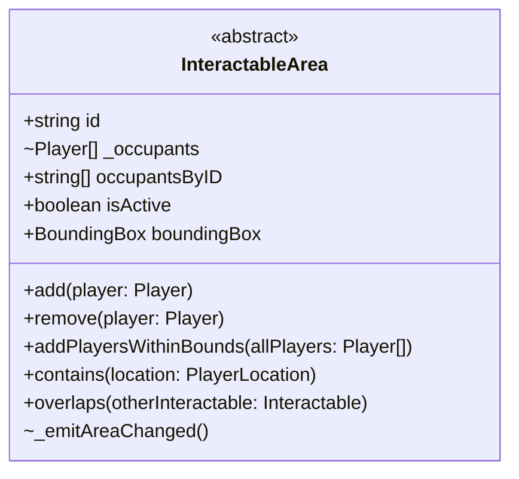

Welcome aboard to the Covey.Town team! We're glad that you're here and ready to join our development team as a new software engineer.
We're building an open source virtual meeting application, and are very happy to see that we have so many new developers who can help make this application a reality.
By the end of the semester, you'll be able to propose, design, implement and test a new feature for our project.
We understand that some of you may have some web development experience, but don't expect that most of you do, and hence, have created an individual project to help you get up to speed with our existing codebase and development environment.

Covey.Town is a web application that consists of some code that runs in each client's web browser, and also code that runs on a server.
Users join the application in a "town": a 2D arcade-style map with different rooms to explore.
Each town is also a video call: when two players get close to each other, they can see and hear each other; there is also a text chat available within the twon.
In Winter of 2021, our lead software engineer, Avery, developed a prototype for Covey.Town, and since then, hundreds of students in this class have built on that codebase.
The most recent class-wide effort added a concept called [Conversation Areas](https://neu-se.github.io/CS4530-Spring-2022/assignments/hw2), allowing players to post a textual description of the topic of their conversation, and making those video conversations private to those players standing within that same area.
Many student projects in Spring 2022 (some of which are [publicly showcased](https://neu-se.github.io/CS4530-Spring-2022/assignments/project-showcase)) involved creating other kinds of flexible interactions that involve objects in the arcade game, other elements displayed in the browser, and video chat.
For example: students created game areas, where players who approached a game board could play a simple game (like tic-tac-toe) together; others created bulletin boards that stored persistent messages; others created viewing areas that allowed multiple players to simultaneously playback the same video as a "watch party."

After studying all of the student projects and their implementation challenges, our lead software engineer, Avery, has refactored Covey.Town, designing a new abstraction to make it easier to create features like these. 
Avery's new abstraction, `InteractableArea`, is a region of the town that provides some interactive elements for players when they enter.
The abstraction cuts across the entire technology stack: `InteractableArea`s exist in the 2D map and the application automatically tracks when players enter and exit them.
By pressing the spacebar within an `InteractableArea`, the user can trigger an interaction with that area, which in turn can be easily used to display new content in the web app using React.
An `InteractableArea` in one user's browser can also emit events that are delivered in real-time to other players interacting with that same area.

The objective for this semester's individual project is to implement this new `InteractableArea` abstraction, with two concrete implementations: `ConversationArea` and `ViewingArea`. While the `ConversationArea` will be implemented by refactoring last semester's code to use the new interface, the  `ViewingArea` is a new concept.
The `ViewingArea` alows players to have "watch parties": each player who is within the `ViewingArea` sees the same streaming video.
If one player pauses the video, it pauses for all other players watching it, and the playback is synchronized between all players watching the video.

